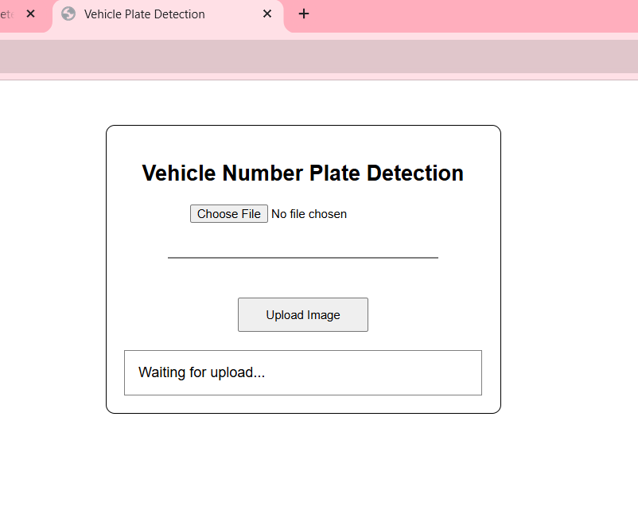
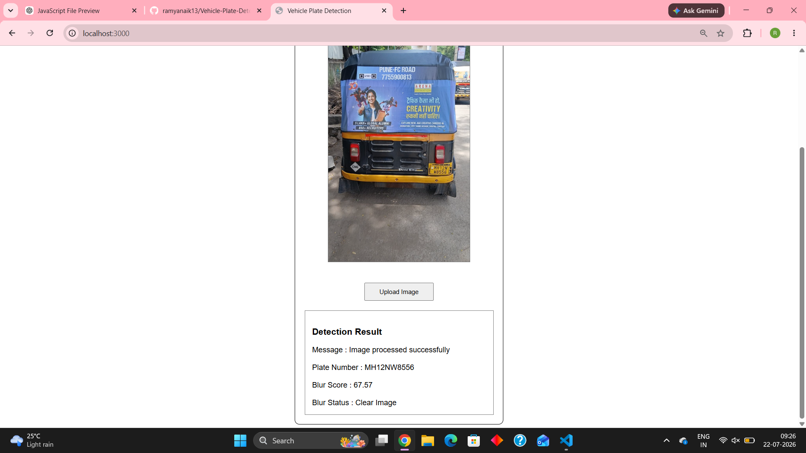
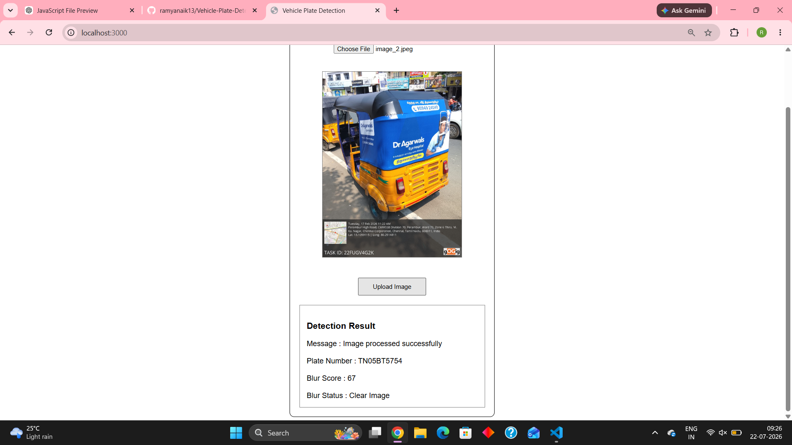
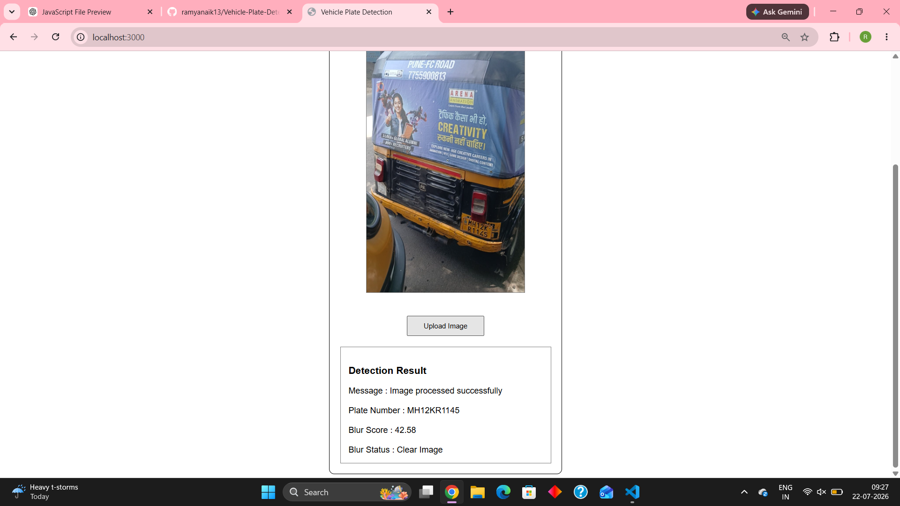

# Vehicle Number Plate Detection

## Project Description

Vehicle Number Plate Detection is a web-based application developed using **Node.js**, **Express.js**, and **MongoDB**. The system allows users to upload an image of a vehicle, processes the image, detects the vehicle's number plate, checks the image quality (blur), and stores the detection results in a MongoDB database.

This project demonstrates image processing, API integration, OCR-based number plate recognition, and database management.

---

## Features

* Upload vehicle images through a web interface.
* Display uploaded image preview.
* Resize and process images using Sharp.
* Detect image blur.
* Detect vehicle number plate.
* Display detected plate number in the browser.
* Store image details and detection results in MongoDB.
* User-friendly interface.

---

## Technologies Used

### Frontend

* HTML5
* CSS3
* JavaScript

### Backend

* Node.js
* Express.js

### Database

* MongoDB
* Mongoose

### Libraries & Tools

* Multer
* Sharp
* Tesseract OCR
* Plate Recognition API
* CORS
* Git & GitHub

---

## Project Structure

```text
MediaProcessingAssignment/
│
├── frontend/
│   └── index.html
│
├── routes/
│   └── upload.js
│
├── services/
│   ├── imageProcessor.js
│   ├── blurDetector.js
│   ├── brightnessDetector.js
│   ├── plateDetector.js
│   └── plateAPIService.js
│
├── models/
│   └── Image.js
│
├── uploads/
│
├── server.js
├── package.json
└── README.md
```

---

## Installation

### 1. Clone the repository

```bash
git clone https://github.com/ramyanaik13/Vehicle-Plate-Detection.git
```

### 2. Open the project

```bash
cd Vehicle-Plate-Detection
```

### 3. Install dependencies

```bash
npm install
```

### 4. Start MongoDB

Make sure your local MongoDB server is running.

### 5. Run the application

```bash
node server.js
```

### 6. Open the application

Open your browser and visit:

```text
http://localhost:3000
```

---

## Workflow

1. Select a vehicle image.
2. Preview the selected image.
3. Click **Upload Image**.
4. Image is resized and processed.
5. Blur detection is performed.
6. Vehicle number plate is detected.
7. Detection result is displayed in the browser.
8. Image details and results are saved to MongoDB.

---

## Sample Output

* Vehicle image uploaded successfully.
* Number plate detected.
* Blur score displayed.
* Detection result shown in the browser.
* Data stored in MongoDB.

---

## Screenshots

Add the following screenshots to this section:

### Home Page



### Result




### Detection Result

*(Insert screenshot here)*

### MongoDB Database

*(Insert MongoDB Compass screenshot here)*

### GitHub Repository

*(Insert GitHub repository screenshot here)*

---

## Future Enhancements

* Improve OCR accuracy.
* Support multiple number plates in a single image.
* Deploy the application online.
* Add user authentication.
* Maintain upload history.
* Improve UI/UX.

---

## Author

**Ramya Naik**

GitHub: https://github.com/ramyanaik13
